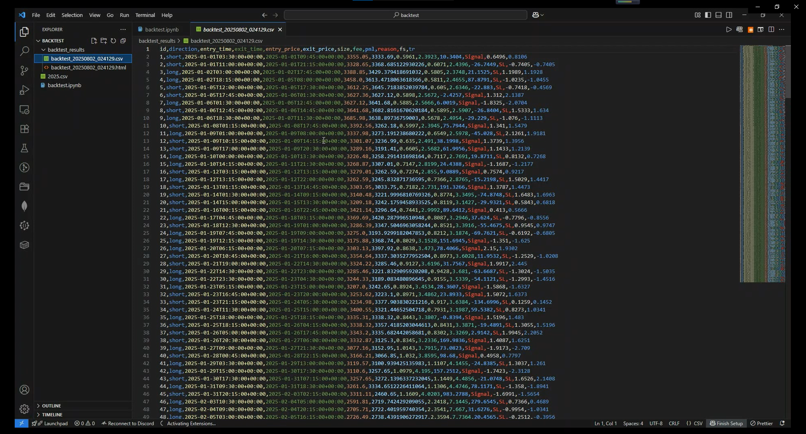
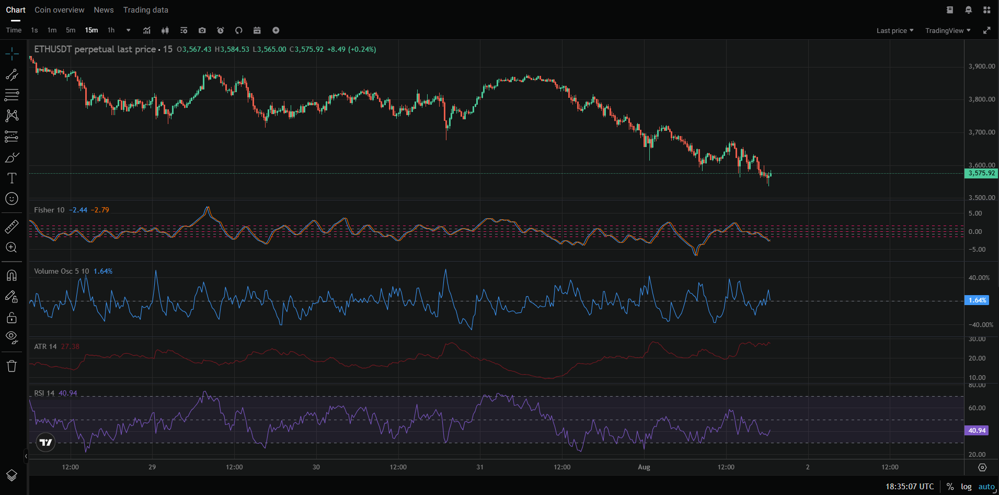
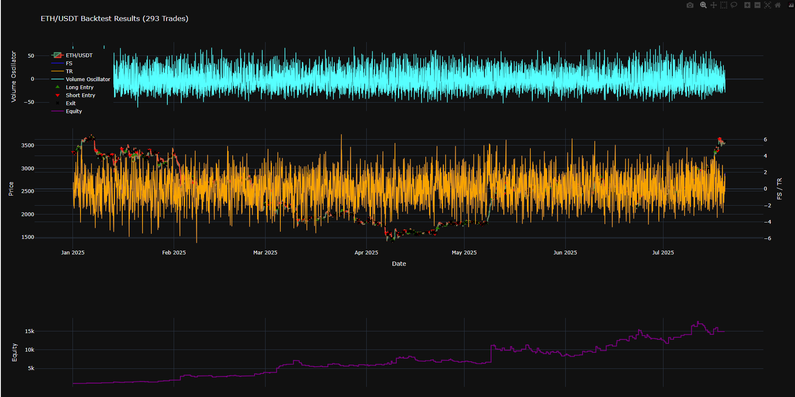

# Momentum Trading Strategy for Crypto Perpetual Futures ( BTC, ETH, SOL ... )

## Overview
This is a momentum-based algorithmic trading system specifically designed for the ETH/USDT perpetual futures market on a 15-minute timeframe. The strategy combines multiple technical indicators to identify high-probability entries and exits while managing risk with dynamic stop-losses. Parameter optimization is done using Optuna to enhance performance across varying market conditions.

## **Video**

## Strategy Components

### Market and Timeframe
- **Asset:** ETH/USDT (Perpetual Futures)
- **Timeframe:** 15-minute candlesticks
- **Leverage:** 10x
- **Position Size:** 20% of account balance per trade
- **Trading Fee:** 0.06% per trade (entry and exit)

### Key Indicators

- **Fisher Transform (FS)**
  - Identifies potential price reversals by transforming price data to Gaussian distribution
  - Parameters: Length = 10 periods
  - Entry: Bullish crossover (FS crosses above trigger)
  - Exit: Opposite crossover when momentum exceeds thresholds
- **Average True Range (ATR)**
  - Measures volatility to set dynamic stop-loss levels
  - Parameters: Length = 14 periods; Stop-loss multiplier applied to ATR
  - Stop-loss is dynamically trailed based on ATR
- **Relative Strength Index (RSI)**
  - Gauges overbought/oversold conditions to filter entries/exits
  - Parameters: Length = 14 periods
  - Entries allowed during neutral momentum
  - Exits triggered on strong directional momentum
- **Volume Oscillator**
  - Confirms trade entries and exits with volume momentum
  - Parameters: Short EMA = 5 periods; Long EMA = 10 periods
  - Entries require positive volume momentum
  - Exits confirmed on elevated volume momentum

### Parameter Optimization
Parameters for all indicators are optimized through [Optuna](https://optuna.org/), an open-source hyperparameter optimization framework. The optimization seeks to maximize performance metrics such as total PnL and profit factor over historical data.

## Trading Rules

### Entry Conditions
#### Long Entry
- Bullish Fisher Transform crossover (FS > trigger)
- Low momentum in FS or trigger
- Neutral RSI momentum
- Positive volume momentum

#### Short Entry
- Bearish Fisher Transform crossover (FS < trigger)
- Low momentum in FS or trigger
- Neutral RSI momentum
- Positive volume momentum

### Exit Conditions
- **Stop-Loss:** Set dynamically using ATR and trailed to lock in profits
- **Signal Exit:** Triggered by opposite Fisher crossover, high momentum, strong RSI, and elevated volume momentum
- Close any open positions at the last candle's close price if data ends

## Backtesting Framework
- Initial balance: $1,000
- Position sizing: 20% with 10x leverage
- Data: Historical ETH/USDT 15-minute candle data (CSV input)
- Outputs:
  - CSV report with trade details (entry/exit, PnL, etc.)
  - Interactive Plotly chart showing price, indicators, and equity curve
  - Summary metrics like total PnL, win rate, profit factor, expectancy

## Risk Management
- Leverage capped at 10x
- Position size limited to 20% of balance
- ATR-based dynamic stop-loss adapts to volatility
- Trading fees (~0.06%) included for entry and exit

## Performance Metrics (Backtest: Jan 1, 2025 – Jul 19, 2025)

- Initial Balance: $1,000
- Final Balance: $15,291.61 (+1429.16%)
- Total Trades: 293
- Win Rate: 48.1%
- Profit Factor: 1.41
- Average Win: $351.20
- Maximum Win: $4,500.18
- Maximum Loss: -$1,045.67
- Expectancy: $48.78

While the win rate is near-even, larger winning trades significantly drive profitability.

## Usage Instructions
1. Provide historical ETH/USDT 15-minute candle data in a CSV file with columns: timestamp, open, high, low, close, volume.
2. Run the Python script to compute indicators, execute backtesting, and generate reports.
3. Analyze the output CSV and interactive Plotly charts for performance insights.

## Conclusion
This strategy offers a systematic and automated approach to trading ETH/USDT perpetual futures on a short timeframe. It effectively combines momentum-based indicators with rigorous risk management and leverages parameter optimization for robust results. The demonstrated backtest performance highlights significant profitability potential with clear, rule-based entry and exit signals.

---

## Contact
For questions or collaboration, you can reach me via Telegram: [@benrey916](https://t.me/benrey916)

*Developed and optimized for robust short-term momentum trading in volatile crypto markets.*
