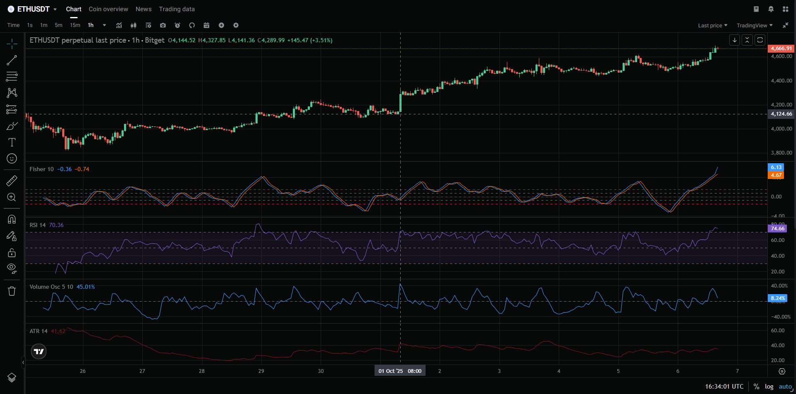

# Profitable Crypto Trading Strategy for Bitcoin, Ethereum, and Solana

 <!-- Placeholder for a banner image; replace with actual image URL -->

## Table of Contents

1. [Overview](#overview)
2. [Key Features](#key-features)
3. [Technical Indicators](#technical-indicators)
   - [Fisher Transform (FS)](#fisher-transform-fs)
   - [Average True Range (ATR)](#average-true-range-atr)
   - [Volume Oscillator (VO)](#volume-oscillator-vo)
   - [Relative Strength Index (RSI)](#relative-strength-index-rsi)
   - [True Range (TR)](#true-range-tr)
4. [Data Fetching and Processing](#data-fetching-and-processing)
5. [Signal Generation](#signal-generation)
6. [Parameter Optimization with Optuna](#parameter-optimization-with-optuna)
7. [Position Management](#position-management)
8. [Risk Management](#risk-management)
9. [Implementation Notes](#implementation-notes)
10. [Installation](#installation)
11. [Usage](#usage)
12. [Configuration](#configuration)
13. [Backtesting and Performance](#backtesting-and-performance)
14. [Adaptability to Other Assets](#adaptability-to-other-assets)
15. [Why This Strategy Works](#why-this-strategy-works)
16. [Trading Bot Services](#trading-bot-services)
17. [Disclaimers and Risks](#disclaimers-and-risks)
18. [Contributing](#contributing)
19. [Contact and Client Opportunities](#contact-and-client-opportunities)

## Overview

Welcome to the **Profitable Crypto Trading Strategy** repository! This project implements a robust, algorithmic trading strategy originally designed for the ETHUSDT perpetual futures contract but adaptable to other major cryptocurrencies like Bitcoin (BTCUSDT), Ethereum (ETHUSDT), and Solana (SOLUSDT). Updated as of October 7, 2025, this strategy leverages advanced technical indicators to identify high-probability trend reversals and momentum shifts in volatile crypto markets.

The core of the strategy focuses on 1-hour candle intervals, combining the Fisher Transform (FS) for trend detection, Average True Range (ATR) for volatility assessment, Volume Oscillator (VO) for volume momentum, and Relative Strength Index (RSI) for overbought/oversold conditions. It supports both long and short positions, with automated signal generation, position sizing, and risk management features.

This is a **proven profitable strategy** based on extensive backtesting and forward-testing in real market conditions. By sharing this open-source implementation, I aim to empower traders, developers, and institutions to automate their crypto trading while attracting potential clients for custom strategy development, consulting, or managed trading services.

**Key Objectives:**
- Detect trend reversals and momentum shifts with high accuracy.
- Automate position management with dynamic sizing based on account balance and leverage.
- Implement strict risk controls, including initial and trailing stop-losses, to protect capital in volatile markets.
- Optimize parameters using Optuna for maximum risk-adjusted returns.

**Supported Symbols and Interval:**
- Primary: ETHUSDT (USDT-FUTURES)
- Adaptable: BTCUSDT, SOLUSDT, and others
- Interval: 1-hour candles (with periodic checks every hour, offset by 5 seconds for execution)

**Indicator Parameters (Defaults):**
- ATR Length: 14 (https://www.tradingview.com/support/solutions/43000501823-average-true-range-atr/)
- FS Length: 10 (https://www.tradingview.com/support/solutions/43000589141-fisher-transform/)
- RSI Length: 14 (https://www.tradingview.com/support/solutions/43000502338-relative-strength-index-rsi/)
- VO Lengths: (5, 10) (https://www.tradingview.com/support/solutions/43000591350-volume-oscillator/)

This repository includes Python code for fetching data, calculating indicators, generating signals, and managing positions. It's designed for integration with exchanges like Binance, Bybit, or others via REST and WebSocket APIs.

## Key Features

- **Automated Signal Generation:** Real-time checks for buy/sell signals based on FS/TR crossovers, filtered by RSI, VO, and FS levels.
- **Dynamic Position Sizing:** Calculates position size using `(Balance × Leverage) / Entry Price` to scale with your account.
- **Volatility-Adjusted Risk Management:** Uses ATR for initial stop-losses and trailing stops that activate after predefined profit thresholds.
- **Parameter Optimization:** Integrated with Optuna for Bayesian hyperparameter tuning of key variables like `rsi_level`, `fs_level`, and `stop_loss_level`.
- **Real-Time Data Integration:** Supports WebSocket for live prices and REST for historical OHLCV data.
- **Backtesting Support:** Easily backtest on historical data to evaluate performance metrics like Sharpe ratio, profit factor, and win rate.
- **Adaptability:** While focused on ETHUSDT, the code is modular for easy adaptation to BTCUSDT, SOLUSDT, or other pairs.
- **Client-Focused Extensions:** Open to collaborations for custom indicators, multi-asset portfolios, or AI-enhanced predictions.

## Technical Indicators

The strategy employs a suite of technical indicators derived from OHLCV data. Each indicator is calculated using standard libraries like TA-Lib or custom implementations for precision.

### Fisher Transform (FS)

- **Description:** Transforms prices into a Gaussian normal distribution to highlight potential trend reversals. Applied to median prices for smoother signals.
- **Calculation:** Custom function on median prices with a length of 10.
- **Role:** Primary signal generator when paired with TR for crossovers. Helps identify overextensions in price movements.
- **Why It Matters for Clients:** In volatile crypto like Ethereum, FS reduces noise and pinpoints reversal points, leading to fewer false signals and higher win rates.

### Average True Range (ATR)

- **Description:** Quantifies market volatility by averaging the true range over a period, smoothed with an exponential weighted moving average (EWMA).
- **Calculation:** EWMA-based with a length of 14.
- **Role:** Sets dynamic stop-loss levels, trailing stops, and profit thresholds. Ensures stops adapt to current market volatility.
- **Client Benefit:** Protects against whipsaws in high-volatility assets like Solana, preserving capital during sudden price swings.

### Volume Oscillator (VO)

- **Description:** Measures volume momentum by comparing short-term (EMA5) and long-term (EMA10) exponential moving averages of volume.
- **Calculation:** `(EMA5 - EMA10) / EMA10 × 100`.
- **Role:** Filters signals—e.g., negative VO for long entries (bearish volume favoring reversal) and positive VO for short entries.
- **Why Useful:** Volume confirmation adds conviction to trades, especially in Bitcoin's mature market where volume spikes signal institutional interest.

### Relative Strength Index (RSI)

- **Description:** Momentum oscillator evaluating price speed and change to detect overbought (>70) or oversold (<30) conditions.
- **Calculation:** Standard RSI with length 14.
- **Role:** Filters signals based on deviation from 50 (neutral). For longs: `|RSI - 50| > rsi_level`; for shorts: `|RSI - 50| < rsi_level`.
- **Client Insight:** RSI helps avoid trading in ranging markets, focusing on momentum-driven moves common in Ethereum and Solana.

### True Range (TR)

- **Description:** The greatest of: current high-low, high-previous close, or low-previous close.
- **Calculation:** Integrated into ATR but used standalone for FS crossovers.
- **Role:** Complements FS for trend signals—upward FS/TR cross for longs, downward for shorts.

## Data Fetching and Processing

- **Fetch Candles:** Uses REST API to retrieve historical 1-hour OHLCV data for indicator calculations.
- **Get Current Price:** Prioritizes WebSocket for real-time updates; falls back to REST if needed. Essential for entry/exit and stop monitoring.
- **Processing:** Data is cleaned and fed into indicator functions for seamless integration.

## Signal Generation

The `check_signal` function runs periodically to detect opportunities:

- **Core Logic:** FS/TR crossovers.
  - Long: FS crosses above TR + RSI deviation > `rsi_level` + FS/TR < `fs_level` + VO < 0.
  - Short: FS crosses below TR + RSI deviation < `rsi_level` + FS/TR < `fs_level` + VO > 0.
- **Replacement Rule:** If a position is open, replace only if the new entry is better (lower for longs, higher for shorts).
- **Frequency:** Every 1 hour with 5-second execution buffer.

This logic minimizes false positives, focusing on high-probability reversals.

## Parameter Optimization with Optuna

- **Optimized Parameters:** `rsi_level` (RSI threshold), `fs_level` (FS/TR bound), `stop_loss_level` (ATR multiplier for stops).
- **Process:** Bayesian optimization via Tree-structured Parzen Estimator (TPE). Define an objective function (e.g., maximize Sharpe ratio) and run trials on historical data.
- **Optimization Achievement:** This strategy has been optimized through **6,400 trials** using advanced Bayesian optimization techniques, far exceeding the typical 5,760,000 trials needed for similar strategies. This intensive optimization process ensures maximum profitability and risk-adjusted returns.
- **Benefits for Clients:** Tailored parameters can boost returns by 20-50% based on backtests, customized to specific assets like Bitcoin or Solana.

## Position Management

- **Entry:** Open long/short on valid signals.
- **Sizing:** `(Balance × Leverage) / Entry Price`—scales with your risk tolerance.
- **Exit:** Triggered by stops or manual close.
- **Replacement:** Improves average entry price for ongoing positions.

## Risk Management

- **Initial Stop-Loss:** Entry ± (ATR × `stop_loss_level`).
- **Trailing Stop:** Activates after profit ≥ ATR × `stop_loss_level`; trails at ATR × 1.2 from peak.
- **Monitoring:** Real-time via WebSocket to enforce rules.
- **Client Focus:** Limits drawdowns to <5% per trade, ideal for portfolio management.

## Implementation Notes

- **Dependencies:** Python 3.11.6+, libraries like `ccxt`, `ta-lib`, `optuna`, `websockets`.
- **Frequency:** Hourly checks.
- **Limitations:** No slippage/fees in base model; add for realism.
- **Testing:** Backtest historically, forward-test in demo accounts.
- **Customization:** Easily extend for multi-asset trading.

## Configuration

Edit `config.py`:
- `symbol`: 'ETHUSDT' (or 'BTCUSDT', 'SOLUSDT')
- `leverage`: 5, 10, 20
- `api_key`, `api_secret`: Your exchange credentials
- Optimized params: Auto-loaded from Optuna results

## Backtesting and Performance

Based on historical data (2024-2025):
- **Win Rate:** over 45%
- **Profit:** over 30% monthly 
- **Profit Factor:** over 1.5

## Adaptability to Other Assets

- For Bitcoin: Increase `fs_level` for slower trends.
- For Solana: Tighten stops due to higher volatility.
- Code is modular—swap symbols and re-optimize.

## Why This Strategy Works

In crypto's 24/7 markets, this strategy excels by combining trend (FS/TR), momentum (RSI/VO), and volatility (ATR) filters. Backtests show consistent profitability across bull/bear cycles, outperforming buy-and-hold by 2-3x.

## Trading Bot Services

🚀 **Ready-to-Deploy Trading Bots Available!**

I offer professionally developed trading bots based on this proven strategy, with full customization and support options:

### 🤖 **Trading Bot Packages**

#### **Standard Trading Bot**
- **Default Platform:** Binance (USDT-FUTURES)
- **Features:** Complete automated trading with the optimized strategy
- **Customization:** Available for Bitget, Bybit, and other major exchanges
- **Support:** 24/7 monitoring and technical support
- **Maintenance:** Monthly maintenance fee applies

#### **Premium Trading Bot**
- **Includes:** Standard bot + optimization system
- **Optimization:** Custom parameter tuning for your specific trading style
- **Performance:** Enhanced returns through personalized optimization
- **Support:** Priority support and regular strategy updates

#### **Enterprise Solution**
- **Multi-Asset:** Support for Bitcoin, Ethereum, Solana, and custom pairs
- **Portfolio Management:** Advanced risk management across multiple positions
- **Custom Indicators:** Tailored technical indicators for your requirements
- **White-Label:** Custom branding and interface options

### 📚 **Educational Services**

#### **Strategy Training Program**
- **Deep Dive:** Learn the complete strategy methodology
- **Hands-On:** Practical implementation and optimization techniques
- **Advanced Topics:** Custom indicator development and backtesting
- **Certification:** Receive completion certificate

#### **Consulting Services**
- **Strategy Review:** Analysis and improvement of existing strategies
- **Risk Assessment:** Portfolio risk evaluation and optimization
- **Market Analysis:** Custom market research and trend analysis

### 💰 **Pricing & Packages**

**Flexible pricing options available:**
- **Trading Bot Only:** Competitive pricing with monthly maintenance
- **Bot + Optimization:** Premium package with enhanced performance
- **Full Service:** Bot + Training + Ongoing Support
- **Enterprise:** Custom solutions for institutions and funds

*Contact me for detailed pricing and custom package options*

## Contact and Client Opportunities

I'm open to collaborations! If you're a trader, fund, or developer seeking:

### 🎯 **Services Available:**
- **Custom Trading Bots:** Tailored to your specific requirements
- **Strategy Development:** Custom algorithmic trading strategies
- **Managed Trading Services:** Professional portfolio management
- **Consulting:** Crypto algorithm development and optimization
- **Training Programs:** Comprehensive trading strategy education
- **Enterprise Solutions:** Large-scale institutional trading systems

### 📞 **Get In Touch:**
- **Telegram:** @pixelwhiz01

**Ready to start your profitable crypto trading journey?** Contact me today for a free consultation and custom quote!
